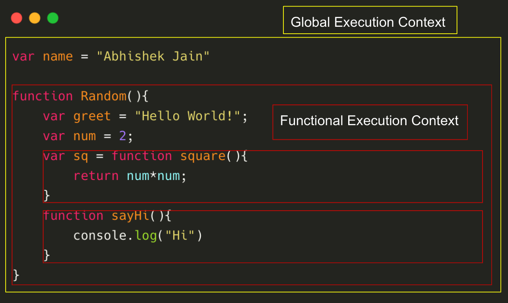

# Javascript Interview Questions

## Table of Contents

| Sl.No | Questions                                                                                                              |
| ----- | ---------------------------------------------------------------------------------------------------------------------- |
| 1.    | [What is Context in Javascript?](#what-is-context-in-javascript)                                                       |
| 2.    | [What are Constructors in Javascript?](#what-are-constructors-in-javascript)                                           |
| 3.    | [What is Call Apply and Bind?](#what-is-call-apply-and-bind)                                                           |
| 4.    | [What is SetTimeout and ClearTimeout?](#what-is-settimeout-and-cleartimeout)                                           |
| 5.    | [What are Prototypes in Javascript?](#what-are-prototypes-in-javascript)                                               |
| 6.    | [What is the difference between Proto and Prototype?](#what-is-the-difference-between-proto-and-prototype)             |
| 7.    | [What is Prototype Inheritance Chain?](#what-is-prototype-inheritance-chain)                                           |
| 8.    | [What is Synchronous and Asynchronous Code?](#what-is-synchronous-and-asynchronous-code)                               |
| 9.    | [What is an Event Loop?](#what-is-an-event-loop)                                                                       |
| 10.   | [What is execution context in Javascript?](#what-is-execution-context-in-javascript)                                   |
| 11.   | [What is Creation phase and Execution phase in Javascript?](#what-is-creation-phase-and-execution-phase-in-javascript) |
| 12.   | [What is Scope in Javascript?](#what-is-scope-in-javascript)                                                           |

<br/>

1. ### What is Context in Javascript?

Context is nothing but the value of `this` keyword in javascript. The `this` keyword basically refers to the object that the function is executing in.

```js
var person = {
  name: "Aman",
  age: 25,
  hello: function(){
    console.log(this);
  }
}

person.hello();

{name: "Abhishek", age: 25, hello: [Function: hello]}
```

<div align="right">
    <b><a href="#">↥ back to top</a></b>
</div>

2. ### What are Constructors in Javascript?

Constructors in Javascript are functions which are used to initialize a set of values or set default values for the objects.

```js
function Person(name, age, email) {
  this.name = name;
  this.age = age;
  this.email = email;
}

var myself = new Person("Abhishek", 25, "abc@gmail.com");
```

<div align="right">
    <b><a href="#">↥ back to top</a></b>
</div>

3. ### What is Call, Apply and Bind?

The Call, Apply and Bind methods are generally used to set the value of `this` keyword irrespective of the way in which a function is called.

`Call()`<br/>
The call method executes the function with a given <i>this</i> value with arguments provided individually.

```js
var obj1 = {
  num: 3,
};

var addTo = function (a, b, c) {
  return this.num + a + b + c;
};

console.log(addTo.call(obj1, a, b, c));
```

`Apply()`<br/>
The apply method is exactly the same as the call method in functionality. The only difference is that the arguments are provided in an array.

```js
var obj2 = {
  num: 3,
};
var addTo = function (a, b, c) {
  return this.num + a + b + c;
};

var arr = [8, 8, 9];

console.log(addTo.apply(obj2, arr));
```

`Bind()`<br/>
The bind method creates a new function that when called has it's <i>this</i> keyword set to the provided value.

```js
var obj3 = {
  num: 3,
};

var addTo = function (a, b, c) {
  return this.num + a + b + c;
};

var newFunc = addTo.bind(obj3);

console.log(newFunc(8, 8, 9));
```

<div align="right">
    <b><a href="#">↥ back to top</a></b>
</div>

4. ### What is SetTimeout and ClearTimeout?

`setTimeout()`<br/>
The SetTimeout function calls the function or evaluates the function after a specified number of milliseconds.

```js
setTimeout(function () {
  console.log("Hello World!");
}, 2000);

//Hello World! will get printed after 2 seconds (2000 milliseconds).
```

`clearTimeout()`<br/>
The clearTimeout function stops the execution of the function specified in the setTimeout.

```js
var func = setTimeout(function () {
  console.log("Hello World!");
}, 2000);

clearTimeout(func);

//Nothing will get printed in the above case.
```

<div align="right">
    <b><a href="#">↥ back to top</a></b>
</div>

5. ### What are Prototypes in Javascript?

Prototypes are the mechanism through which Javascript objects inherits properties and methods from one another. Whenever a function is created in Javascript, the JS Engine adds a prototype property to the function.

<ul>
<li>Array object inherits from Array.prototype</li>
<li> Date object inherits from Date.prototype</li>
<li> Person object inherits from Person.prototype</li>
</ul>

<div align="right">
    <b><a href="#">↥ back to top</a></b>
</div>

6. ### What is the difference between Proto and Prototype?

The main difference between the two is that `prototype` is a property of the constructor while `__proto__` is a property of the instance of that constructor.

```js
var arr = ["Abhishek", "Aman"];

arr.__proto__;
//[constructor: ƒ, concat: ƒ, copyWithin: ƒ, fill: ƒ, find: ƒ, …]

Array.prototype;
//[constructor: ƒ, concat: ƒ, copyWithin: ƒ, fill: ƒ, find: ƒ, …]
```

<div align="right">
    <b><a href="#">↥ back to top</a></b>
</div>

7. ### What is Prototype Inheritance Chain?

Every object in Javascript eventually inherits the properties and methods from `Object.prototype`. This is called the Prototype chain.
This is the reason why we say that almost everything in Javascript is an object.

```js
var arr = ["Abhishek", "Aman"];

arr.__proto__;
//[constructor: ƒ, concat: ƒ, copyWithin: ƒ, fill: ƒ, find: ƒ, …]

arr.__proto__.__proto__;
//{constructor: ƒ, __defineGetter__: ƒ, __defineSetter__: ƒ, hasOwnProperty: ƒ, __lookupGetter__: ƒ, …}

arr.__proto__.__proto__.__proto__;
//null
```

In the above example we could see that the `arr` inherits its properties and methods from `Array` Constructor which in turn inherits its properties and methods from the `Object` Constructor which is then pointing to null. This is nothing but the Prototype Chain.

<div align="right">
    <b><a href="#">↥ back to top</a></b>
</div>

8. ### What is Synchronous and Asynchronous Code?

A `synchronous` code is a code in which the statements of the code are executed in sequence. Each statement waits for the previous statement to finish before executing.

An `asynchronous` code is the one in which the next statement doesn't wait for the previous statement to finish executing.

`Synchronous`

```js
var a = 10;
function func() {
  console.log(a);
}
func();
```

<br/>

`Asynchronous`

```js
console.log("start");

setTimeout(function () {
  console.log("The wait time is 2 seconds");
}, 1000);

console.log("end");

// start
// end
// The wait time is 2 seconds
```

<div align="right">
    <b><a href="#">↥ back to top</a></b>
</div>

9. ### What is an Event Loop?

The `event loop` is the secret behind the Javascript asynchronous behaviour. The event loop is like an endless loop which keeps on checking whether there is something to be executed in the `call stack`. If the call stack is found to be empty, the `event queue` is checked. If there are some methods present in the event queue, then the methods are pushed one by one to the call stack where they are executed.

<div align="right">
    <b><a href="#">↥ back to top</a></b>
</div>

10. ### What is Execution Context in Javascript?

Execution context refers to the environment in which the code is executed. It is the execution context only which decides which piece of code has access to objects, functions, variables etc.

The Execution context is divided into the following two

<ul>
<li>Global Execution Context</li>
<li>Functional Execution Context</li>
</ul>

`Global Execution Context`<br/>
Whenever your code runs for the very first time, it gets attached to the Global Context. There can only be <i>one</i> Global Execution Context in the entire process.

`Functional Execution Context`<br/>
Whenever the code is being executed and it encounters a function, then a functional execution context is created. There can be several functional Execution contexts depending on the number of functions.



<div align="right">
    <b><a href="#">↥ back to top</a></b>
</div>

11. ### What is Creation phase and Execution phase in Javascript?

`Creation phase`<br/>
In the creation phase, the compiler runs through the code twice before actually executing the code.

<ol>
<li> In the first run, the compiler picks up all the functional declarations and stores them in the memory with their references. </li>
<li> In the second run, the compiler picks up all the variable declarations and assigns <i>undefined</i> to them.
</ol>

`Execution phase`<br/>
In the execution phase, the following 2 things happens

<ol>
<li> The variables are assigned the values
</li> 
<li>The functions are executed </li>
</ol>

<div align="right">
    <b><a href="#">↥ back to top</a></b>
</div>

12. ### What is Scope in Javascript?

Scope determines the place where the variables, functions or objects can be accessed.

There are 2 types of Scope

<ol>
<li> Global Scope </li>
<li> Local Scope </li>
</ol>

### `1. Global Scope`<br/>

The area outside all the functions is considered to be the global scope. The variables defined in the global scope can be accessed and altered in any other scopes. There is ony <i>one</i> global scope.

```js
var pi = 3.14;
console.log(pi); // 3.14

function getPi() {
  console.log(pi);
}

getPi(); // 3.14
```

### `2. Local Scope`<br/>

Variables that are declared inside the functions become local to the function and are thus accessible only inside their local scope. Every function has its own local Scope.

Local Scope further can be divided into 2

<ul>
<li>Functional scope</li>
<li>Block Scope</li>
</ul>

`Functional Scope`<br/>
Whenever you declare a variable inside of a function, the variable is accessible within the function only. You cannot access the variable outside of the function. `var` is the keyword used to define the variable with functional scope.

```js
function func() {
  var x = 10;
  console.log(x);
}

console.log(x); // ReferenceError: x is not defined
func(); // 10
```

`Block Scope`</br>
A block scope is the area which is enclosed by the `{}` brackets. The statements such as if, switch, for, while etc. generally start with the curly brackets, and hence constitute a block. In ES6, the introduction of `let` and `const`
was done which is used to define a block. The variables are thus not accessible outside of the block.

```js
function foo() {
  if (true) {
    var x = 11;
    let y = 12;
    console.log(x); // 11
    console.log(y); // 12
  }
  console.log(x); // 11
  console.log(y); // ReferenceError: y is not defined
}
foo();
```

<div align="right">
    <b><a href="#">↥ back to top</a></b>
</div>
